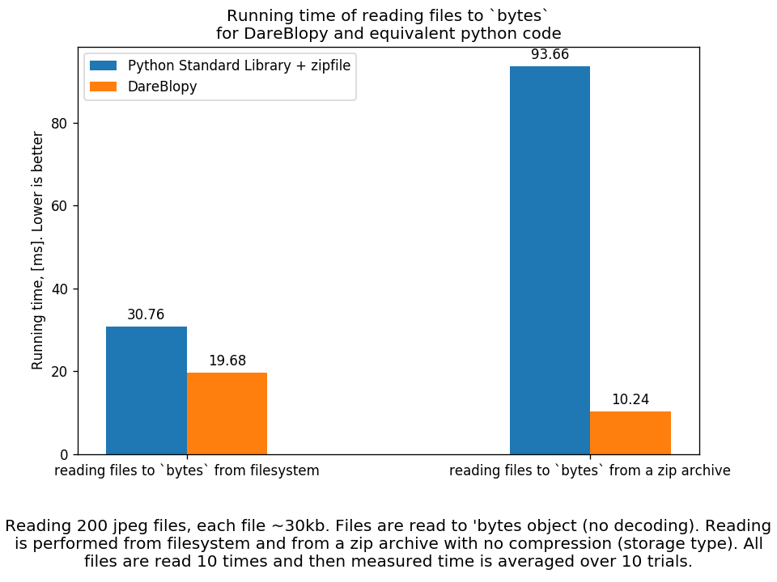
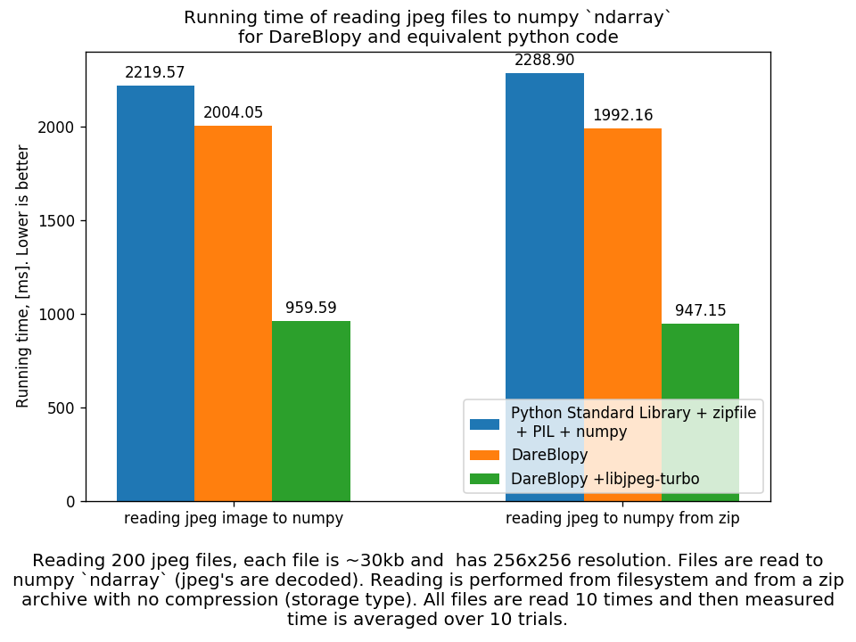
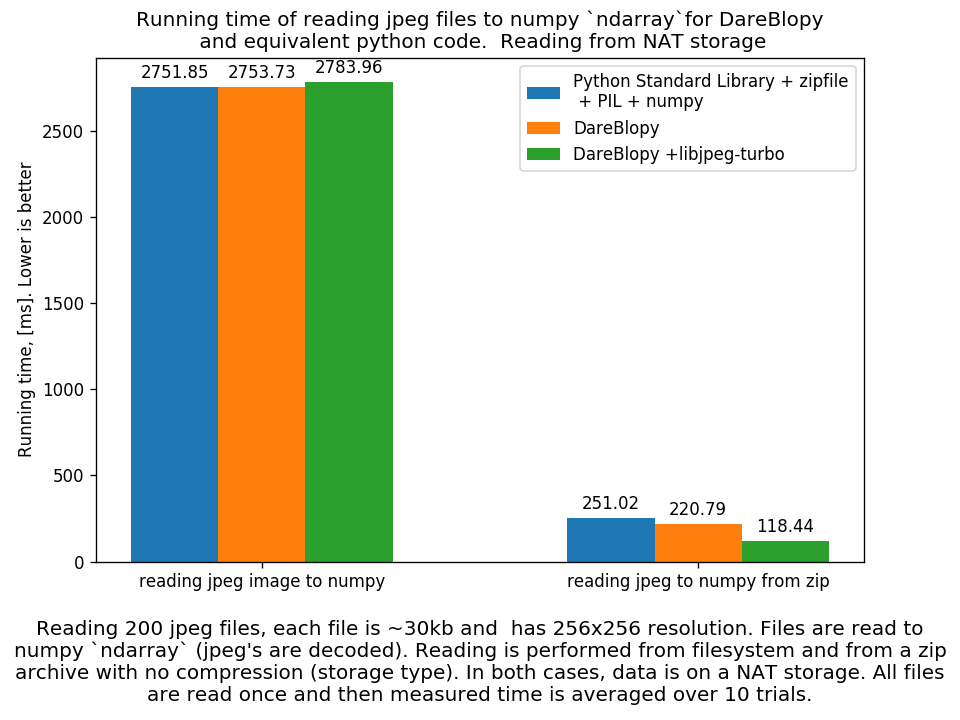
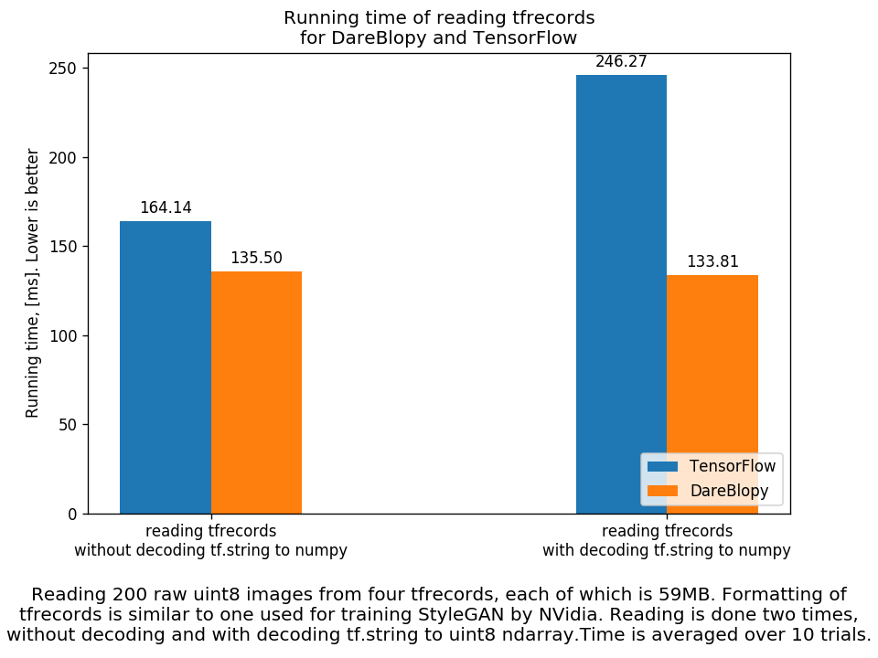

<h1 align="center">
  <br>
  
  <br>
</h1>
<h4 align="center">Framework agnostic, faster data reading for DeepLearning.</h4>
<h4 align="center">A native extension for Python built with C++ and <a href="https://github.com/pybind/pybind11" target="_blank">pybind11</a>.</h4>

  <p align="center">
    <a href="#installation">Installation</a> •
    <a href="#why">Why?</a> •
    <a href="#what-is-the-performance-gain">What is the performance gain?</a> •
    <a href="#tutorial">Tutorial</a> •
    <a href="#license">License</a>
  </p>
  
<p align="center">
  <a href="https://badge.fury.io/py/dareblopy"></a>
  <a href="https://pepy.tech/project/dareblopy"></a>
  <a href="https://opensource.org/licenses/Apache-2.0"></a>
  <a href="https://api.travis-ci.com/podgorskiy/bimpy.svg?branch=master"></a>
</p>


**Da**ta**Re**ading**Blo**cks for **Py**thon is a python module that provides collection of C++ backed data reading primitives.
It targets deep-learning needs, but it is framework agnostic.

### Installation
Available as pypi package:
```
$ pip install dareblopy
```

To build from sources refer to [wiki page](https://github.com/podgorskiy/DareBlopy/wiki/Building-from-sources).

## Why?

Development initially started to speedup reading from **ZIP** archives, reduce copying data, increase time of [GIL](https://wiki.python.org/moin/GlobalInterpreterLock) being released to improve concurrency.

*But why reading from **ZIP** archive?* Reading a ton of small files (which is often the case) can be slow, specially if the drive is network attached, e.g. with **NFS**. However, the bottle neck here is hardly the disk speed, but the overhead of filesystem, name-lookup, creating file descriptors, and additional network usage if NFS is used.

If, all the small files are agglomerated into larger file (or several large files), that improves performance substantially. This is exactly the reason behind [**TFRecords** in **TensorFlow**](https://www.tensorflow.org/tutorials/load_data/tfrecord):

> To read data efficiently it can be helpful to serialize your data and store it in a set of files (100-200MB each) that can each be read linearly. This is especially true if the data is being streamed over a network. This can also be useful for caching any data-preprocessing.

The downside of **TFRecords** is that it's **TensorFlow** only.

A much simpler, yet still effective solution is to store data in **ZIP** archive with zero compression. However, using **zipfile** package from standard library can be slow, since it is implemented purely in **Python** and in certain cases can cause unnecessary data copying. 

That's precisely the reason behind development of **DareBlopy**. In addition to that it also has such features as:

* Readying JPEG images directly to numpy arrays (from **ZIP** and from filesystem), to reduce memory usage and unnecessary data copies.
* Two JPEG backends selectable at run-time: **libjpeg** and **libjpeg-turbo**. Both backends are embedded into **DareBlopy** and do not depend on any system package.
* Reading of **TFRecords** (not all features are support though) without dependency on **TensorFlow** that enables usage of datasets stored as **TFRecords** with ML frameworks other than **TensorFlow**, e.g. **Pytorch**.
* Random yielders,  iterators and, dataloaders to simplify doing DataLearning with **TFRecords** with other ML frameworks.
* No dependency on system packages. You install it from pip - it works.
* Support for compressed **ZIP** archives, including [**LZ4** compression](https://github.com/lz4/lz4).
* Virtual filesystem. Allows *mounting* of zip archives.

## What is the performance gain?
Well, it depends a lot on a particular use-case. Let's consider several. All details of the benchmarks you can find in [run_benchmark.py](https://github.com/podgorskiy/DareBlopy/blob/master/run_benchmark.py). You can also run it on your machine and compare results to the ones reported here.

#### Reading files to *bytes*
**Python**'s **bytes** object can be a bit nasty. Generally speaking, you can not return from C/C++ land data as a **bytes** object without making a data copy. That's because memory for **bytes** object must be allocated as one chunk for both, the header and data itself. In **DareBlopy** this extra copy is eliminated, you can find details [here](https://github.com/pybind/pybind11/issues/1236).

In this test scenario, we read 200 files, each of which ~30kb. Reading is done from local filesystem and from a **ZIP** archive.

Reading files using **DareBlopy** is faster even when read from filesystem, but when read from **ZIP** it provides substantial improvement.
 
<p align="center">

</p>

#### Reading JPEGs to **numpy**'s *ndarray*
This is where **DareBlopy**'s feature of direct readying to **numpy** array is demonstrated. When the file is read, it is decompressed directly to a preallocated numpy array, and all of that happens on C++ land while **GIL** is released.

Note: here PIL v.7.0.0 is used, on Ubuntu 18. In my installation, it does not use **libjpeg-turbo**. 

<p align="center">

</p>

It this case, difference between **ZIP**/filesystem is quite insignificant, but things change dramatically if filesystem is streamed over a network:

<p align="center">

</p>


#### Reading TFRecords
**DareBlopy** can read **TensorFlow** records. This functionality was developed in the first place for reading FFHQ dataset from TFRecords.

It introduces alias to `string` type: `uint8`, which allows to return directly **numpy** array if the shape is known beforehand.

For example, code like:

```python
        features = {
            'data': db.FixedLenFeature([], db.string)
        }
```

Can be replaced with:

```python
        features = {
            'data': db.FixedLenFeature([3, 32, 32], db.uint8)
        }
```

This decoding to numpy array comes at zero cost, which is demonstrated below:

<p align="center">

</p>

## Tutorial


## License

[Apache License 2.0](LICENSE)
